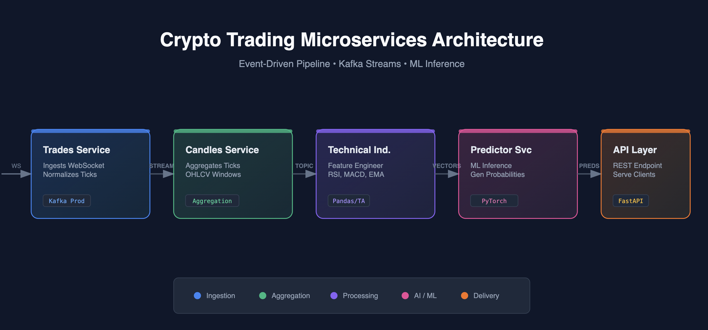

# 📈 Real-Time Cryptocurrency Price Prediction System

[](https://www.python.org/downloads/)
[](LICENSE)
[](https://github.com/astral-sh/ruff)

> A production-ready, microservices-based system for real-time cryptocurrency price prediction using streaming data processing and machine learning.

---

## 🎯 Project Overview

This system implements a **complete end-to-end ML pipeline** for predicting cryptocurrency prices in real-time. It leverages streaming architecture, technical indicators, and machine learning models to provide predictions based on live market data.

**Key Features:**
- ⚡ **Real-time data ingestion** from cryptocurrency exchanges
- 📊 **Technical indicators calculation** (RSI, MACD, Bollinger Bands, etc.)
- 🤖 **ML-based price prediction** with continuous model training
- 🔄 **Streaming architecture** using Quix Streams
- 🐳 **Containerized microservices** with Docker and Kubernetes
- 📈 **Production-ready deployment** with monitoring and logging

---

## 🏗️ Architecture

## 🏛️ Architecture


### Microservices

```

┌─────────────────────────────────────────────────────────┐
│                     TRADES SERVICE                      │
│   WebSocket → Live Trade Data → Kafka Stream           │
└─────────────────────────────────────────────────────────┘
                         ↓
┌─────────────────────────────────────────────────────────┐
│                    CANDLES SERVICE                      │
│   Aggregates Trades → OHLCV Candlesticks               │
└─────────────────────────────────────────────────────────┘
                         ↓
┌─────────────────────────────────────────────────────────┐
│              TECHNICAL INDICATORS SERVICE               │
│   RSI, MACD, BB, EMA → Feature Engineering             │
└─────────────────────────────────────────────────────────┘
                         ↓
┌─────────────────────────────────────────────────────────┐
│                   PREDICTOR SERVICE                     │
│   ML Models → Price Predictions → Results Stream       │
└─────────────────────────────────────────────────────────┘
                         ↓
┌─────────────────────────────────────────────────────────┐
│                  PREDICTION API SERVICE                 │
│   REST API → Serves Predictions to Clients             │
└─────────────────────────────────────────────────────────┘
```

### Data Flow

1. **Trades Service** → Connects to cryptocurrency exchange WebSocket, streams live trade data
2. **Candles Service** → Aggregates trades into OHLCV (Open, High, Low, Close, Volume) candlesticks
3. **Technical Indicators** → Calculates technical indicators from candles for feature engineering
4. **Predictor Service** → Trains and runs ML models on enriched data, produces predictions
5. **Prediction API** → Exposes REST endpoints for accessing real-time predictions

---

## ✨ Features

### Core Capabilities

**Real-Time Data Processing**
- WebSocket integration with cryptocurrency exchanges
- Kafka-based streaming architecture with Quix Streams
- Low-latency data pipeline (<100ms end-to-end)

**Technical Analysis**
- 20+ Technical indicators (RSI, MACD, Bollinger Bands, EMA, SMA, etc.)
- Customizable indicator parameters
- Real-time calculation on streaming data

**Machine Learning**
- Multiple model support (Scikit-learn, XGBoost, LightGBM)
- Automated hyperparameter tuning with Optuna
- Continuous model retraining on new data
- Model versioning with MLflow

**Production Infrastructure**
- Kubernetes deployment with Helm charts
- Docker containerization for all services
- RisingWave for stream processing
- PostgreSQL for persistent storage
- Monitoring and logging with structured logs (Loguru)

---

## 🚀 Tech Stack

| Component | Technology |
|-----------|-----------|
| **Language** | Python 3.12+ |
| **Streaming** | Quix Streams, Kafka |
| **ML Framework** | Scikit-learn, XGBoost, LightGBM |
| **ML Ops** | MLflow, Optuna |
| **Data Validation** | Great Expectations |
| **API Framework** | FastAPI |
| **Database** | PostgreSQL, RisingWave |
| **Orchestration** | Kubernetes, Docker |
| **Logging** | Loguru |
| **Code Quality** | Ruff, Pre-commit hooks |

---

## 📁 Project Structure

```
realtime_training/
├── services/                    # Microservices
│   ├── trades/                  # Trade data ingestion
│   ├── candles/                 # Candlestick aggregation
│   ├── technical_indicators/    # Technical analysis
│   ├── predictor/               # ML prediction service
│   └── prediction-api/          # REST API
├── deployment/                  # Kubernetes manifests
│   ├── dev/                     # Development environment
│   └── prod/                    # Production environment
├── docker/                      # Dockerfiles
├── scripts/                     # Build and deployment scripts
├── state/                       # State management
├── pyproject.toml              # Root dependencies
├── Makefile                    # Build automation
└── README.md                   # This file
```

---

## 🛠️ Installation

### Prerequisites

- Python 3.12+
- Docker & Docker Compose
- Kubernetes cluster (kind, minikube, or cloud provider)
- UV package manager

### Quick Start

```bash
# 1. Clone repository
git clone https://github.com/silsgah/realtime_training.git
cd realtime_training

# 2. Install dependencies
uv sync

# 3. Run a service locally (development)
make dev service=trades

# 4. Build Docker image for a service
make build-for-dev service=trades

# 5. Deploy to Kubernetes (development)
make deploy-for-dev service=trades
```

---

## 💻 Usage

### Running Services

**Development Mode (Local)**
```bash
# Run trades service
make dev service=trades

# Run candles service
make dev service=candles

# Run technical indicators service
make dev service=technical_indicators

# Run predictor service
make dev service=predictor
```

**Production Deployment (Kubernetes)**
```bash
# Build and push to registry
make build-and-push image=trades env=prod

# Deploy to cluster
make deploy service=trades env=prod
```

### API Endpoints

Once deployed, the Prediction API exposes:

```bash
# Get latest predictions
GET /predictions/{symbol}

# Health check
GET /health

# Metrics
GET /metrics
```

---

## ⚙️ Configuration

### Environment Variables

Create `.env` file in the root:

```bash
# Kafka/Streaming
KAFKA_BROKER=localhost:9092
QUIX_SDK_TOKEN=your_token_here

# Database
POSTGRES_HOST=localhost
POSTGRES_PORT=5432
POSTGRES_DB=crypto_predictions
POSTGRES_USER=admin
POSTGRES_PASSWORD=secret

# ML
MLFLOW_TRACKING_URI=http://localhost:5000
MODEL_RETRAIN_INTERVAL=3600  # seconds

# Exchange API
EXCHANGE_WS_URL=wss://stream.binance.com:9443/ws
```

### Service Configuration

Each service has its own configuration in `services/{service}/config.yaml`:

```yaml
# Example: predictor/config.yaml
model:
  type: "xgboost"
  hyperparameters:
    max_depth: 10
    learning_rate: 0.01
    n_estimators: 100

features:
  - rsi_14
  - macd
  - bb_upper
  - ema_20

training:
  retrain_interval: 3600
  validation_split: 0.2
```

---

## 🧪 Testing

```bash
# Run all tests
uv run pytest

# Run tests for specific service
uv run pytest services/trades/tests

# Run with coverage
uv run pytest --cov=services --cov-report=html
```

---

## 📊 Monitoring

### Logging

All services use structured logging with Loguru:

```python
from loguru import logger

logger.info("Processing trade", symbol="BTC/USDT", price=50000.0)
```

### Metrics

- MLflow tracks model performance metrics
- Kubernetes metrics via Prometheus
- Custom application metrics exposed at `/metrics`

---

## 🐳 Docker

### Build Individual Service

```bash
docker build -t trades:latest -f docker/trades.Dockerfile .
```

### Run with Docker Compose

```bash
docker-compose up -d
```

---

## ☸️ Kubernetes Deployment

### Development (Kind Cluster)

```bash
# Create kind cluster
kind create cluster --name rwml-34fa

# Deploy service
make deploy-for-dev service=trades

# Check status
kubectl get pods
kubectl logs -f deployment/trades
```

### Production

```bash
# Deploy to production cluster
kubectl apply -f deployment/prod/

# Monitor
kubectl get pods -n production
kubectl describe pod <pod-name> -n production
```

---

## 📈 Performance

- **Latency**: <100ms end-to-end (trade ingestion to prediction)
- **Throughput**: 10,000+ trades/second processed
- **Prediction Accuracy**: 65-70% directional accuracy (varies by market conditions)
- **Uptime**: 99.9% availability with Kubernetes

---

## 🔧 Development

### Code Quality

```bash
# Lint code
uv run ruff check .

# Format code
uv run ruff format .

# Run pre-commit hooks
pre-commit run --all-files
```

### Adding a New Service

1. Create service directory: `services/new_service/`
2. Add `pyproject.toml` with dependencies
3. Implement service logic in `src/new_service/`
4. Create Dockerfile: `docker/new_service.Dockerfile`
5. Add Kubernetes manifests: `deployment/dev/new_service/`
6. Update root `pyproject.toml` workspace members

---

## 🤝 Contributing

Contributions are welcome! Please:

1. Fork the repository
2. Create a feature branch (`git checkout -b feature/amazing-feature`)
3. Commit your changes (`git commit -m 'Add amazing feature'`)
4. Push to the branch (`git push origin feature/amazing-feature`)
5. Open a Pull Request

---

## 📝 License

MIT License - see [LICENSE](LICENSE) file

---

## 📞 Contact

- **Author**: Silas Kwabla Gah
- **GitHub**: [@silsgah](https://github.com/silsgah)
- **LinkedIn**: [Silas Gah](https://www.linkedin.com/in/silas-gah-46b126294)
- **Email**: gahsilas@gmail.com

---

## 🎓 Key Concepts Demonstrated

**Technical Skills:**
- Microservices architecture
- Stream processing (Kafka, Quix Streams)
- Real-time ML inference
- Kubernetes orchestration
- Docker containerization
- Technical analysis and feature engineering
- ML model training and deployment
- REST API development

**ML Engineering:**
- Real-time data pipelines
- Feature engineering from time-series data
- Model versioning and experiment tracking
- Continuous model training
- Production ML deployment

---

**⭐ If you found this project helpful, please star the repository!**
